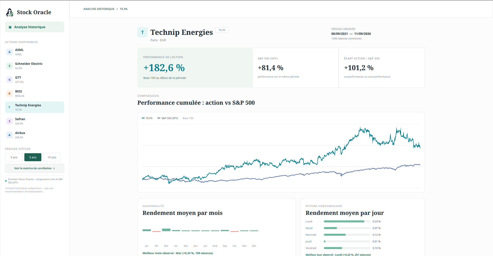

# **Stock Oracle**

---

Stock Oracle is a french/english desktop application for exploring simple historical patterns in stock market data.
It displays historical performance for a configurable list of stocks.

Each stock can be compared with the S&P 500 through a normalized performance chart.

The application highlights historically stronger months and weekdays based on average daily returns.
It also compares two simple historical trading strategies based on daily opening and closing prices.
A correlation matrix shows how the configured stocks have moved relative to one another.

For the selected stock, the dashboard also shows its current trailing P/E (PER), plus the median and average P/E observations available from Yahoo Finance over the selected period. Negative and unavailable P/E values are excluded rather than estimated.

The available stocks are defined in a TOML configuration file.

Market data is sourced from Yahoo Finance.

Historical strategy results exclude trading costs, spreads, taxes, liquidity, and market impact.

The results describe historical observations and are not predictions or investment advice.

When market data is unavailable, the application clearly indicates this and uses simulated data that should not be used for analysis.

---

## See Stock Oracle in action



---

## Quickstart

### Install

```sh
python3 -m venv .venv
source .venv/bin/activate
pip install -r requirements.txt
```

### Run

```sh
python src/app.py
```

### Configure

The available stocks and the default interface language are defined exclusively in:

```text
config/config.toml
```

The default configuration includes ASML, Schneider Electric, GTT, BESI, Technip Energies, Safran, and Airbus. Modify this file to change the stocks displayed by the application. Under `[application]`, set `language = "fr"` (default) or `language = "en"`. The in-app FR/EN selector can also switch language without a restart; the TOML setting is used at launch.
